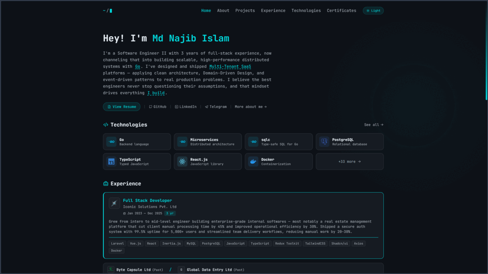

# Md Najib Islam — Personal Portfolio

A developer portfolio built with React, TypeScript, and Tailwind CSS. Features a terminal-inspired design with dark/light theme support, custom cursors, and a monospace aesthetic powered by JetBrains Mono.



## Features

- **Terminal-inspired UI** — monospace typography, custom cursor, blinking terminal caret
- **Dark / Light theme** — smooth toggle with view-transition circular reveal
- **Bento grid widgets** — GitHub activity heatmap, location map, currently working on
- **Fully responsive** — mobile-first with glassmorphism bottom navigation
- **Fast** — Vite build, preloaded fonts, optimized asset loading
- **SEO ready** — Open Graph meta, sitemap, robots.txt

## Tech Stack

- **Framework:** React 19 + TypeScript
- **Styling:** Tailwind CSS v4
- **Build:** Vite
- **Fonts:** JetBrains Mono (self-hosted)
- **Maps:** Leaflet
- **Deployment:** Netlify

## Getting Started

```bash
# Clone
git clone https://github.com/developernajib/personal-portfolio.git
cd personal-portfolio

# Install dependencies
npm install

# Set up environment
cp .env.example .env
# Edit .env with your GitHub token and resume URL

# Set up data files (Manually)
# Copy data/*.example.ts files to data/*.ts and fill in your info

# Run dev server
npm run dev
```

## Project Structure

```
src/
├── components/
│   ├── layout/      # Header, Footer, BottomNav, ErrorBoundary
│   └── ui/          # Reusable components (Container, Buttons, Cards)
├── pages/           # Route pages (Home, About, Projects, Experience, etc.)
├── hooks/           # Custom React hooks
├── types/           # TypeScript type definitions
└── index.css        # Global styles and theme variables
data/
├── *.example.ts     # Template data files (tracked)
└── *.ts             # Personal data files (gitignored)
```

## Environment Variables

| Variable            | Description                                        |
| ------------------- | -------------------------------------------------- |
| `VITE_GITHUB_TOKEN` | GitHub personal access token (for activity widget) |
| `VITE_RESUME_URL`   | Public URL to your resume PDF                      |

## Image Thumbnails

Every image in `public/projects/` and `public/certificates/` needs a matching thumbnail with a `-thumb` suffix. Thumbnails are used in card grids for faster loading — full-res images load only when clicked.

```
public/projects/my-app.png           ← full resolution (detail page / lightbox)
public/projects/my-app-thumb.png     ← thumbnail ~300-400px wide (card grid)
```

Generate thumbnails with ImageMagick:

```bash
magick original.png -resize 400x -strip -define png:compression-level=9 original-thumb.png
```

See [`data/setup.md`](data/setup.md) for detailed image guidelines.

## License

Licensed under the [MIT](LICENSE)

---

### 📜 Author

**Md. Najib Islam**
_Software Engineer_

[](https://github.com/developernajib)
[](https://orcid.org/0009-0005-8578-7790)
[](https://t.me/developernajib)

_"Building solutions that matter, one line of code at a time."_

Made with ❤️ by [DeveloperNajib](https://github.com/developernajib)
